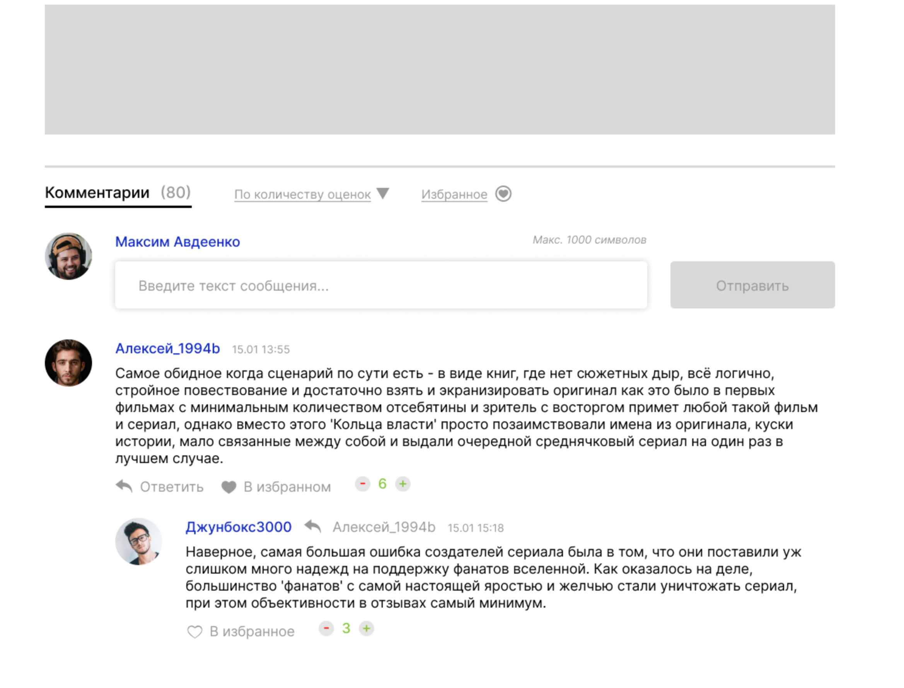

<p align="center">
  <a href="" rel="noopener">
 </a>
</p>

<h3 align="center">commentJS</h3>

<div align="center">

[]()
[](https://github.com/kylelobo/The-Documentation-Compendium/issues)
[](https://github.com/kylelobo/The-Documentation-Compendium/pulls)
[](/LICENSE)

</div>

---

<p align="center"> Фронтенд-часть для модуля системы комментариев
    <br> 
</p>


# CommentsJS

## Table of Contents

- [About](#about)
- [Getting Started](#getting_started)

## 🧐 About <a name = "about"></a>

Фронтенд-часть для модуля системы комментариев

## 🔧 Getting Started <a name = "getting_started"></a>

Эти инструкции помогут вам создать копию проекта в локальном окружении для разработки и тестирования. 

###  Installing
```
git clone  https://github.com/siestacloud/commentJS.git
cd commentJS/ 
npm i
npm run build
yarn run start
```
---